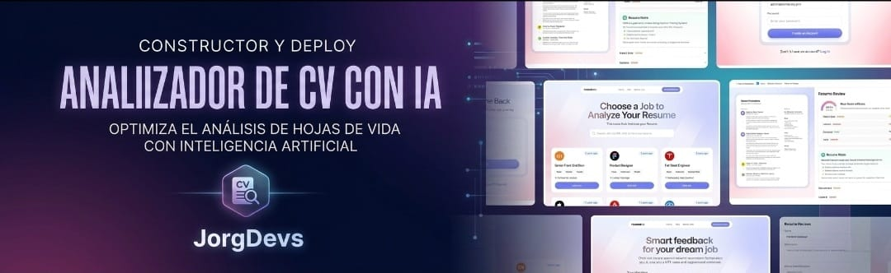

 <div align="center">
 <br />
    <a href="" target="_blank">
      
    </a>
  <br />
 
 <div>
    
        
        
    
  </div>

  <h3 align="center">Analizador de CV con IA</h3>

  </div>


## 📋 <a name="table">Table of Contents</a>

1. ✨ [Introduccion](#introduction)
2. ⚙️ [Tech Stack](#tech-stack)
3. 🔋 [Caracteristicas](#features)
4. 🤸 [Quick Start](#quick-start)


## <a name="introduction">✨ Introduccion</a>

¡Crea un analizador de currículums con IA usando React, React Router y Puter.js! Implementa una autenticación fluida, sube y almacena currículums, y relaciona candidatos con ofertas de empleo mediante evaluaciones inteligentes con IA. Obtén comentarios personalizados y puntuaciones ATS adaptadas a cada oferta, todo ello en una interfaz de usuario limpia y reutilizable.


## <a name="tech-stack">⚙️ Tech Stack</a>

- **[React](https://react.dev/)** Es una popular biblioteca JavaScript de código abierto para construir interfaces de usuario utilizando componentes reutilizables y un DOM virtual, lo que permite crear aplicaciones nativas y de una sola página eficientes y dinámicas.


- **[React Router v7](https://reactrouter.com/)** Es la biblioteca de enrutamiento por excelencia para aplicaciones React, que ofrece rutas anidadas, cargadores/acciones de datos, límites de error, división de código y compatibilidad con SSR, todo ello con una ruta de actualización sencilla desde la versión 6.

- **[Puter.com](https://jsm.dev/resumind-puter)** Es un sistema operativo de Internet avanzado y de código abierto, diseñado para ser completo, excepcionalmente rápido y altamente extensible. Computer se puede usar como: una nube personal que prioriza la privacidad para mantener todos tus archivos, aplicaciones y juegos en un lugar seguro, accesibles desde cualquier lugar y en cualquier momento.


- **[Puter.js](https://jsm.dev/resumind-puterjs)** Es un pequeño SDK del lado del cliente que agrega autenticación sin servidor, almacenamiento, base de datos e IA (GPT, Claude, DALL·E, OCR…) directamente a su aplicación de navegador, sin necesidad de un backend y con los costos a cargo de los usuarios.

- **[Tailwind CSS](https://tailwindcss.com/)** is a utility-first CSS framework that allows developers to design custom user interfaces by applying low-level utility classes directly in HTML, streamlining the design process.

- **[TypeScript](https://www.typescriptlang.org/)** Es un superconjunto de JavaScript que añade tipado estático, lo que proporciona mejores herramientas, calidad de código y detección de errores para los desarrolladores, lo que lo hace ideal para crear aplicaciones a gran escala.


- **[Vite](https://vite.dev/)** Es una herramienta de compilación rápida y un servidor de desarrollo que utiliza módulos ES nativos para un inicio instantáneo, reemplazo de módulos en caliente y compilaciones de producción con tecnología Rollup, perfecto para el desarrollo web moderno.


- **[Zustand](https://github.com/pmndrs/zustand)** Es una biblioteca minimalista de gestión de estado basada en hooks para React. Permite gestionar el estado global sin código repetitivo, sin proveedores de contexto y con un rendimiento excelente gracias a las suscripciones de estado selectivas.

## <a name="features">🔋 Caracteristicas</a>

👉 **Autenticación fácil y práctica**: Gestiona la autenticación completamente en el navegador con Puter.js; no requiere backend ni configuración.

👉 **Carga y almacenamiento de currículums**: Permite a los usuarios subir y almacenar todos sus currículums en un solo lugar, de forma segura y fiable.

👉 **Análisis de currículums con IA**: Publica una oferta de empleo y obtén una puntuación ATS con comentarios personalizados para cada currículum.

👉 **Interfaz de usuario moderna y reutilizable**: Diseñada con componentes limpios y consistentes para una interfaz atractiva y fácil de mantener.

👉 **Reutilización de código**: Aprovecha los componentes reutilizables y una base de código modular para un desarrollo eficiente.

👉 **Compatibilidad multidispositivo**: Diseño totalmente adaptable que funciona a la perfección en todos los dispositivos.

👉 **Interfaz de usuario/experiencia de usuario moderna**: Diseño limpio y adaptable creado con Tailwind CSS y shadcn/ui para una experiencia de usuario fluida.

Y muchas más, incluyendo la arquitectura del código y la reutilización.


## <a name="quick-start">🤸 Inicio Rapido</a>

Follow these steps to set up the project locally on your machine.

**Prerequisites**

Make sure you have the following installed on your machine:

- [Git](https://git-scm.com/)
- [Node.js](https://nodejs.org/en)
- [npm](https://www.npmjs.com/) (Node Package Manager)

**Cloning the Repository**

```bash
git clone https://github.com/JorgDevs/ia-resumen-analyzer.git
cd ai-resume-analyzer
```

**Installation**

Install the project dependencies using npm:

```bash
npm install
```

**Running the Project**

```bash
npm run dev
```

Open [http://localhost:5173](http://localhost:5173) in your browser to view the project.

## Building for Production

Create a production build:

```bash
npm run build
```

## Deployment

### Docker Deployment

To build and run using Docker:

```bash
docker build -t my-app .

# Run the container
docker run -p 3000:3000 my-app
```

The containerized application can be deployed to any platform that supports Docker, including:

- AWS ECS
- Google Cloud Run
- Azure Container Apps
- Digital Ocean App Platform
- Fly.io
- Railway


